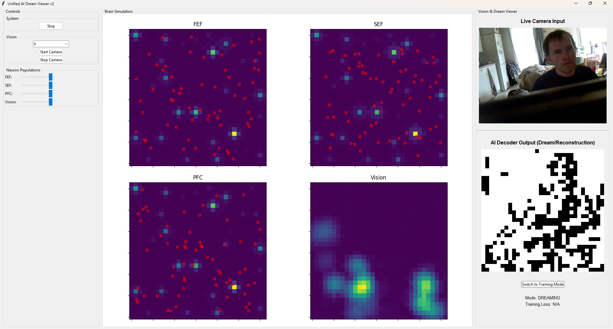

# Unified AI Dream Viewer

EDIT:

Added version 2 that uses only a single fractal field per layer. They were inherited from earlier chess instanton code.. 
This one works faster due to the fields not being shown so you can have more neurons in the fields. Added a text file 
about the new version also. 

This project is a real-time, interactive simulation of a hybrid neural system that visually demonstrates principles of computational neuroscience, including self-organization and the theory of perception as "controlled hallucination."

The application runs a simulated brain that can "perceive" the world through a webcam and can be switched into a "dreaming" state where it generates images purely from its own internal dynamics. An AI decoder model is trained in real-time to act as a "brain scanner," translating the simulated brain's activity into a human-visible image.



## Core Components

1.  **The Simulated Brain (`HybridBrainSystem`):** A model composed of four interconnected brain areas (FEF, SEF, PFC, Vision). It is a hybrid system, containing:
    * **Continuous Neural Fields:** The colored backgrounds that represent the overall electrical potential of an area.
    * **Discrete Neurons:** Individual spiking neurons (represented by red dots) that are influenced by and, in turn, influence their local field.

2.  **The AI Decoder (`DecoderUNet`):** A U-Net convolutional neural network built with PyTorch. This model acts as a "mind-reader." It is trained to look at the patterns of activity across the four brain fields and reconstruct the image that the brain is "seeing" or "imagining."

3.  **The Tkinter GUI (`DreamViewerApp`):** A graphical user interface that serves as the control panel and observatory. It allows you to:
    * Control the simulation (start/stop, manage neuron populations).
    * View the raw brain activity in real-time.
    * View the output of the AI Decoder, showing the brain's "perception" or "dream."

## Modes of Operation

The application demonstrates two key modes, illustrating the concept of controlled hallucination:

* **🧠 Training Mode (Perception):** In this default mode, the system is "perceiving." The simulated brain is fed input from your webcam, and the AI Decoder learns to make its output match the webcam image. You can watch the "Training Loss" decrease as the AI gets better at interpreting the brain's activity.

* **✨ Dreaming Mode (Imagination):** When you switch to this mode, the connection to the webcam is severed for the AI. The simulated brain runs in a closed loop, driven only by its own internal, self-sustaining dynamics. The AI Decoder continues to interpret the brain's activity, providing a live video feed of the system's "dreams" or internal monologue.

## How to Run

1.  **Setup Environment:**
    It is recommended to use a Python virtual environment.
    ```bash
    python -m venv venv
    source venv/bin/activate  # On Windows, use `venv\Scripts\activate`
    ```

2.  **Install Dependencies:**
    Install all the required libraries using the `requirements.txt` file.
    ```bash
    pip install -r requirements.txt
    ```
    *Note: For GPU acceleration (highly recommended for training), please install the CUDA-enabled version of PyTorch by following the instructions on the official [PyTorch website](https://pytorch.org/).*

3.  **Run the Application:**
    Execute the main Python script from your terminal.
    ```bash
    python ai_dream_viewer.py
    ```

4.  **Interact:**
    * Use the controls in the left panel to add neurons and start the camera.
    * Click the main "Start" button to begin the simulation and AI training.
    * Watch the "AI Decoder Output" window as the reconstruction improves.
    * Click the "Switch to Dreaming Mode" button to watch the system generate its own imagery.

## Technologies Used
* **Python 3**
* **Tkinter** for the graphical user interface.
* **PyTorch** for the deep learning decoder model.
* **OpenCV** for webcam processing.
* **Matplotlib** for embedding the brain simulation plots.
* **NumPy** & **SciPy** for numerical and scientific computing.
